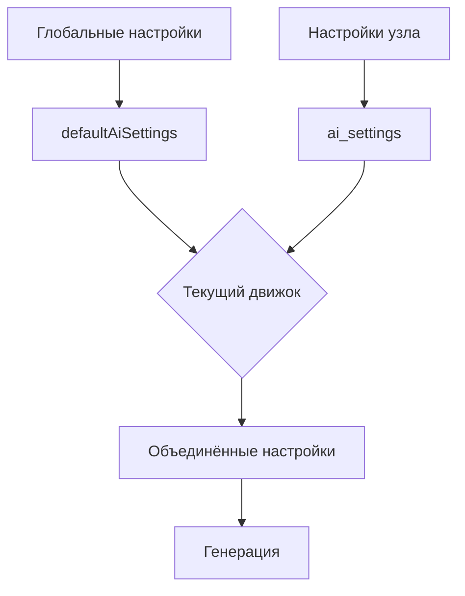

# Рефакторинг настроек AI

## Цель
Переработать подход с настройками AI: разделить настройки по движкам, добавить возможность хранения настроек по умолчанию и переопределения на уровне узлов (plan node / lore node).

## Изменения

### 1. Создание наследников AiSettings
- Создать файлы `src/shared/grok-ai-settings.ts` и `src/shared/yandex-ai-settings.ts`.
- Каждый интерфейс расширяет `AiSettings` и может добавлять специфичные для движка поля (например, для Yandex можно добавить `search_index_id` в будущем).
- Пока что оба интерфейса идентичны базовому, но оставляем возможность расширения.

### 2. Обновление интерфейса AiConfigStore
- В `src/backend/lib/ai-engine-adapter.ts` изменить `AiConfigStore`:
  - Убрать `last_model` из подобъектов `grok` и `yandex`.
  - Добавить поле `defaultAiSettings` типа `GrokAiSettings` / `YandexAiSettings` соответственно.
  - Сохранить `api_key`, `folder_id`, `available_models` и другие конфигурационные поля.
- Обновить `src/backend/routes/ai-config.ts` и `src/backend/settings/settings-repository.ts` для работы с новой структурой.

### 3. Добавление колонки ai_settings в таблицы
- В `src/backend/db/schema.sql` добавить колонку `ai_settings TEXT` (JSON) в таблицы `plan_nodes` и `lore_nodes`.
- Создать миграцию (файл `src/backend/db/migrations/019.ts`), которая добавляет колонку и заполняет её NULL.
- Обновить типы `PlanNodeRow` и `LoreNodeRow` (в соответствующих shared файлах) для включения поля `ai_settings`.

### 4. Обновление репозиториев и сервисов
- В `PlanNodeRepository` и `LoreNodeRepository` добавить поддержку чтения/записи `ai_settings`.
- В `PlanNodeService` и `LoreNodeService` обеспечить обработку `ai_settings` при патче.
- При создании узла инициализировать `ai_settings` как `NULL` (или пустой объект `{}`).

### 5. Обновление фронтенда: checkbox "использовать нестандартные настройки AI"
- В компоненте `NodeEditor.tsx` добавить checkbox, который отображается только если выбран движок.
- Состояние checkbox определяется наличием непустых настроек для текущего движка в `ai_settings` узла.
- При изменении checkbox:
  - Если снимаем галочку: очищаем настройки для текущего движка в `ai_settings` (устанавливаем `{}`).
  - Если ставим галочку: копируем настройки из глобальных `defaultAiSettings` этого движка в `ai_settings` узла.
- Форма `AiGenerationSettings` показывается только когда checkbox включен.
- Значения формы инициализируются как `{ ...defaultAiSettings, ...nodeAiSettings }`.

### 6. Обновление компонента AiGenerationSettings
- Поддержать движко-специфичные поля (пока не требуется).
- При изменении настроек в форме обновлять `ai_settings` узла для текущего движка.

### 7. Обновление логики генерации
- В `generate-lore.ts` и `generate-plan.ts` при получении `settings` из параметров нужно объединить:
  1. Глобальные defaultAiSettings для текущего движка.
  2. Настройки из `ai_settings` узла для текущего движка (если есть).
  3. Настройки, переданные непосредственно в вызов (имеют наивысший приоритет).
- Убрать использование `last_model` из конфига, вместо этого использовать `model` из объединённых настроек.

### 8. Тестирование
- Обновить существующие тесты, чтобы они учитывали новую структуру.
- Написать новые тесты для проверки логики объединения настроек и работы checkbox.

## Последовательность выполнения

1. **Переключиться в режим Code** для редактирования TypeScript файлов.
2. **Создать файлы наследников AiSettings** (grok-ai-settings.ts, yandex-ai-settings.ts).
3. **Обновить AiConfigStore** и удалить last_model.
4. **Создать миграцию** для добавления колонки ai_settings.
5. **Обновить репозитории и сервисы**.
6. **Обновить фронтенд** (NodeEditor, AiGenerationSettings).
7. **Обновить логику генерации**.
8. **Протестировать изменения**.

## Диаграмма потока данных

## Примечания
- Обратная совместимость не требуется, можно ломать API.
- Убедиться, что все изменения проходят type checking и линтинг.
- После реализации проверить работу генерации с разными движками.

## Следующий шаг
Запросить переключение в режим Code для начала реализации.