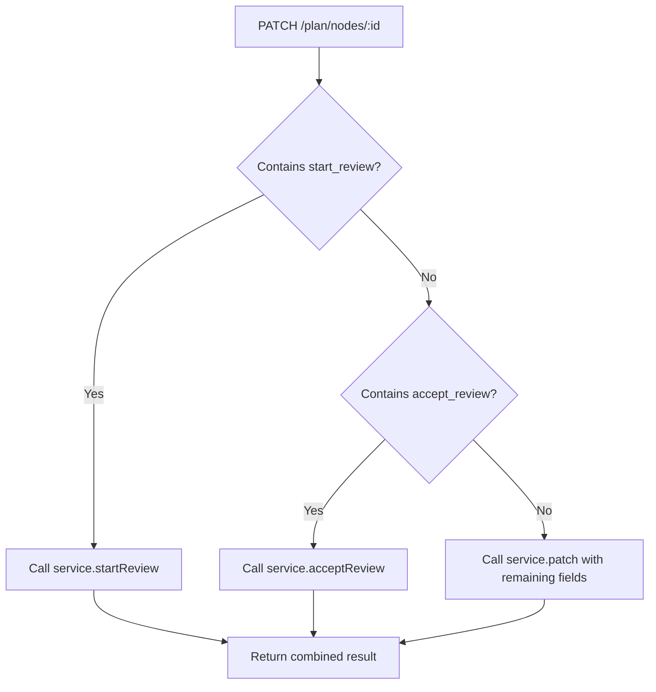

# Refactor Plan Node Service Patch

## Goal
Align patch data with `Partial<PlanNodeInsert>` and separate review operations (`start_review`, `accept_review`) into dedicated service methods.

## Changes Required

### 1. PlanNodeService updates
- Add `startReview(id: number, options?: { prompt?: string; content?: string }): void`
- Add `acceptReview(id: number): void`
- Modify `patch` method to:
  - Remove handling of `prompt`, `start_review`, `accept_review` fields
  - Add support for `last_improve_instruction`, `changes_status`, `review_base_content` as regular fields (optional)
  - Ensure only fields belonging to `PlanNodeInsert` are processed

### 2. PlanNodeRepository updates
- No changes required (already supports updating any column via `update` method).

### 3. Route handler updates (`plan-graph-nodes.ts`)
- Modify `patchPlanNode` to extract review fields and call appropriate service methods.
- Map `prompt` field to `last_improve_instruction` (or keep as alias for compatibility).
- Pass remaining fields to `service.patch`.

### 4. Lore node route updates (`lore.ts`)
- Similar changes as above for consistency (optional but recommended).

### 5. Frontend updates
- Update `NodeEditor.tsx` to use `last_improve_instruction` instead of `prompt` (if we decide to rename).
- Ensure `start_review` and `accept_review` still work (they will be handled by route layer).
- Alternatively, update frontend to call separate endpoints (if we decide to break API).

## Detailed Steps

### Step 1: Switch to Code Mode
We need to edit TypeScript files, which requires code mode. Request mode switch.

### Step 2: Implement PlanNodeService changes
- Insert new methods after `updateStatus`.
- Update `patch` method: remove lines 237-252 and add handling for `last_improve_instruction`, `changes_status`, `review_base_content` as regular fields.

### Step 3: Update route handlers
- In `plan-graph-nodes.ts`, modify `patchPlanNode` to:
  - If `start_review` is true, call `service.startReview(id, { prompt, content })` (where content is from data.content if provided).
  - If `accept_review` is true, call `service.acceptReview(id)`.
  - Remove those fields from data before passing to `service.patch`.
  - Map `prompt` to `last_improve_instruction` (or keep as alias).

### Step 4: Update lore route similarly (optional)
- Apply analogous changes to `lore.ts`'s `patchLoreNode`.

### Step 5: Update frontend (if necessary)
- Change `prompt` to `last_improve_instruction` in patch calls.
- Ensure `start_review` and `accept_review` are still sent as booleans.

### Step 6: Run tests
- Execute existing tests to ensure no regressions.
- Update any failing tests due to changed behavior.

## Notes
- Backward compatibility is not required per user instruction, but we can keep the same API shape for simplicity.
- The frontend currently uses `prompt`, `start_review`, `accept_review` fields; we can keep them as-is in the route layer and map accordingly.

## Mermaid Diagram (Optional)

## Next Action
Request switch to code mode to begin implementation.